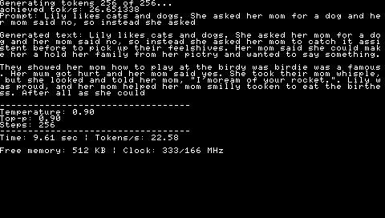

# Llama-3 PSP
Inference Llama-3 in C on Playstation Portable (PSP) by Caio Madeira.
Based on the inference work by ytmytm for [Llama 2 for c64](https://github.com/ytmytm/llama2.c64), which is
based in a port of [llama2.c](https://github.com/karpathy/llama2.c).
Thanks to [hackday for posting](https://hackaday.com/2025/08/17/llama-habitat-continues-to-expand-now-includes-the-psp/)  


[Reposted by Yann LeCun](https://www.facebook.com/yann.lecun/posts/llama-2-has-been-ported-to-the-psp-in-addition-to-the-raspberry-pi-486-pc-commod/10161114909482143/)




## Summary
- [Supported Models](#supported-models)
- [Screenshots](#supported-models)
- [How to run](#supported-models)
- [About](#supported-models)

## Extra docs
- [Changelog](CHANGELOG.md)


## Supported models
| Model | Params | Series | Link | 
|----------|:----------:|----------:| ----------:|
| TinyStories | 260K | Tiny Llamas |[ model](https://huggingface.co/karpathy/tinyllamas/tree/main/stories260K)

## Screenshots

## How to run
Go to release and download your prefered version.

Copy the __Llama3PSP__ folder to ```PSP/GAME```.  

For __.ISO__ just copy to ```ISO``` on PSP ROOT.  


## About

[Linkedln](https://www.linkedin.com/in/caio-madeira/)  
[My blog](https://caiomadeira.github.io/)  
[NLP Post](https://nlp.pucrs.br/news)  
[Llama 2 PSP version Reposted by Yann LeCun](https://www.facebook.com/yann.lecun/posts/llama-2-has-been-ported-to-the-psp-in-addition-to-the-raspberry-pi-486-pc-commod/10161114909482143/)
[Post on hackday](https://hackaday.com/2025/08/17/llama-habitat-continues-to-expand-now-includes-the-psp/)